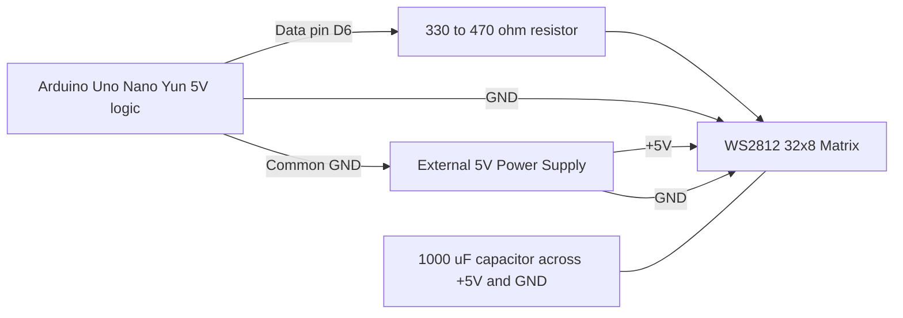
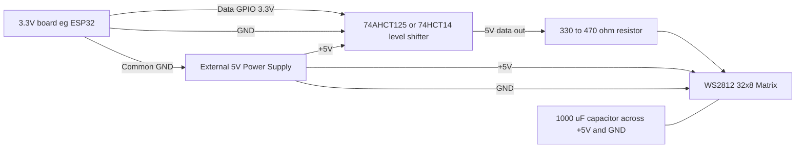
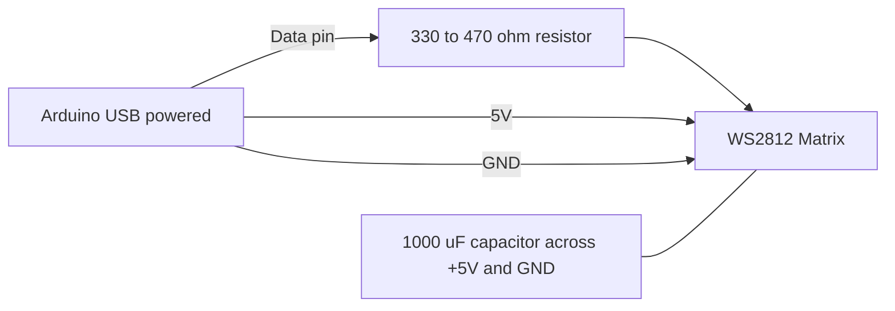
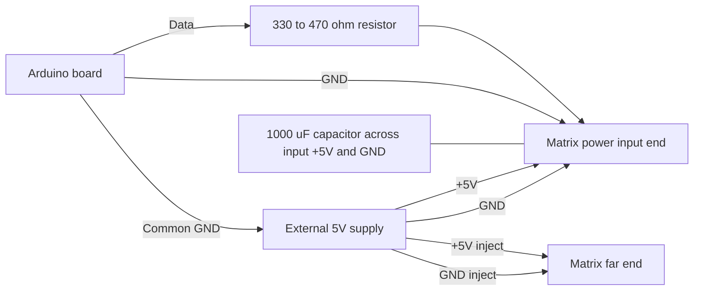

# Wiring Options for 32x8 WS2812 Matrix

This file provides multiple hardware wiring diagrams for different Arduino board and power choices.

## Quick Answer: Does the Arduino Board Type Matter?

Yes, sometimes.

1. Ground wiring and external 5V matrix power recommendations are the same across boards.
2. The main difference is the data signal voltage level and current budget.
3. 5V logic boards (Uno/Nano/Yun) usually drive WS2812 DIN directly.
4. 3.3V logic boards (ESP32, some modern boards) are more reliable with a 74AHCT125/74HCT14 level shifter for DIN.
5. Regardless of board type, do not power a large matrix from the board 5V pin.
6. The capacitor goes across the matrix +5V and GND rails near the matrix input; it does not plug into the Arduino board.
7. A 330 to 470 ohm resistor on the data line is a normal choice.

## Option A: Uno/Nano/Yun (5V Logic, External 5V Matrix PSU)

Notes:
- Data pin can be changed in `hardware_config.h`.
- Keep data line short and routed away from noisy power wiring.
- Place the capacitor physically at the matrix power input: one lead on +5V, the other on GND.
- The resistor has no polarity, so either lead can face the board or the matrix.

## Option B: 3.3V Logic Board with Level Shifter (Preferred for Reliability)

Notes:
- Power the level shifter from 5V so the output high level is suitable for WS2812 DIN.
- Common ground between board, shifter, and matrix is required.
- The capacitor still goes across the matrix power rails, not on the board side.
- The resistor is non-polarized and can be installed in either direction.

## Option C: Small Test Setup (Board USB Power, Low Brightness Only)

Notes:
- Use only for short bring-up tests and very low brightness.
- Not recommended for sustained full-matrix animations.
- The capacitor connects to the matrix +5V and GND pins or screw terminals, whichever the panel uses.
- The resistor can go either way because it has no polarity.

## Option D: Recommended Production Wiring (Power Injection Ready)

Notes:
- Injection at the far end helps reduce voltage drop on brighter scenes.
- Use appropriate wire gauge based on expected current.
- Keep the capacitor at the input end, directly across the same +5V and GND feed used by the matrix.
- The resistor has no direction, so its orientation does not matter.

## Board Type Guidance

1. Uno/Nano/Yun-class 5V boards:
   - Easiest direct-data setup.
   - Still use external matrix power for 32x8.
2. 3.3V boards:
   - May work directly in some cases, but level shifter is best practice.
3. Any board with weak/noisy power source:
   - Keep logic and matrix power separate and tie grounds.

## Safety and Stability Checklist

1. Add 330 to 470 ohm resistor on DIN.
2. Add 1000 uF capacitor across matrix +5V/GND.
3. Confirm common ground everywhere.
4. Start with low brightness.
5. Enable bring-up mode in `hardware_config.h` before full show mode.

## Why The Capacitor Is Needed

The capacitor gives the matrix a small local reserve of power. That helps smooth fast current spikes when many LEDs turn on at once, which reduces flicker and resets. It is a support part for the matrix power rail, not a substitute for proper external power.

## Capacitor Polarity

For a polarized electrolytic capacitor, wire it as follows:

1. Positive lead to +5V.
2. Negative lead to GND.
3. Look for the stripe on the case to identify the negative side.
4. When in doubt, do not guess; verify the marking before powering on.
